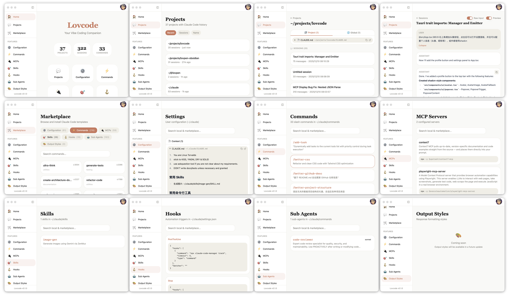

# Lovcode

A desktop companion app for AI coding tools. Browse Claude Code chat history, manage configurations, commands, skills, and more.




## Features

- **Chat History Viewer** - Browse and search conversation history across all projects
- **Commands Manager** - View and manage slash commands (`~/.claude/commands/`)
- **MCP Servers** - Configure and monitor MCP server integrations
- **Skills** - Manage reusable skill templates
- **Hooks** - Configure automation triggers
- **Sub-Agents** - Manage AI agents with custom models
- **Marketplace** - Browse and install community templates

## Installation

```bash
# Install dependencies
pnpm install

# Run development
pnpm tauri dev

# Build for distribution
pnpm tauri build
```

## Tech Stack

- **Frontend**: React 19, TypeScript, Tailwind CSS, Vite
- **Backend**: Rust, Tauri 2
- **UI Components**: shadcn/ui

## License

MIT
