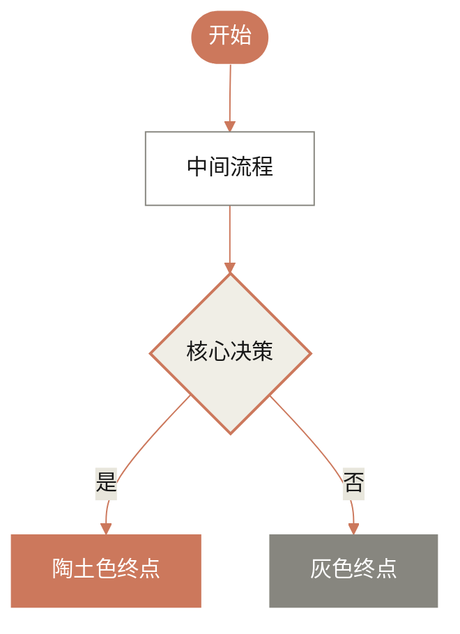

## 设计风格

### **核心设计哲学 (Core Design Philosophy)**

> **风格关键词**：
> **温暖学术 (Warm Academic)** | **纸质质感 (Paper-feel)** | **优雅衬线 (Elegant Serif)** | **极简人文 (Humanist Minimal)**

这种风格不使用冷冰冰的科技蓝或纯白，而是模仿**高质感印刷品**的阅读体验，传达“智慧、值得信赖、冷静”的品牌形象。

---

### **1. 色彩体系 (Color Atmosphere)**

*   **画布背景 (Canvas)**: 不要使用 `#FFFFFF` 纯白。
    *   *描述*：**暖米色 (Warm Beige)**、**燕麦色 (Oat)**、**象牙白 (Ivory)**。
    *   *Hex 参考*: `#F9F9F7` (主底色), `#F0EEE6` (次底色)。
*   **文字颜色 (Ink)**: 不要使用 `#000000` 纯黑。
    *   *描述*：**炭灰色 (Charcoal)**、**深石墨色 (Deep Graphite)**。
    *   *Hex 参考*: `#181818` (正文), `#87867F` (注释/次要)。
*   **点缀色 (Accents)**: 来源于自然界的矿物与植物色调。
    *   *核心点缀*：**陶土色 (Clay/Terracotta)** —— 用于主按钮或高亮。
    *   *辅助色板*：无花果紫 (Fig)、橄榄绿 (Olive)、仙人掌绿 (Cactus)、灰蓝 (Sky)。

### **2. 排版与形状 (Typography & Shape)**

*   **字体配对**:
    *   **标题**: **经典衬线体 (Serif)** (如 Georgia, Times)。赋予页面“文学性”和“权威感”。
    *   **正文**: **干净无衬线体 (Sans-serif)** (如 Inter, Arial)。确保长文阅读的清晰度。
*   **形状语言**:
    *   **柔和圆角**: 卡片和按钮采用明显的圆角（Roundness），看起来像打磨过的鹅卵石，没有尖锐的棱角。
    *   **扁平深度**: 极少的阴影，通过边框和背景色块区分层级，模仿纸张拼贴的效果。

---

### **3. AI 生成工具专用提示词 (Prompts for Tools)**

#### **A. 用于 Midjourney / DALL-E (图像生成)**

> **Prompt:**
> UI design of a modern AI landing page, style of Anthropic Claude. **Aesthetic:** Warm academic, intellectual, high-end minimalist. **Colors:** Background is warm off-white (#F9F9F7), text is deep charcoal, accents in terracotta clay. **Typography:** Elegant Serif headings paired with clean Sans-serif body text. **Elements:** Soft rounded cards, plenty of whitespace, flat design with subtle textures, matte finish, feels like a digital newspaper or high-quality magazine. No neon colors, no dark mode, no futuristic glowing effects. --v 6.0

#### **B. 用于 v0.dev / Web 生成 (UI生成)**

> **Prompt:**
> Create a landing page with a **"Warm Academic"** design theme. Use a background color of `cream/ivory (#F9F9F7)`. Use a **Serif font** for all main headings (H1, H2) to give it a literary feel, and a Sans-serif for body text. **Primary Action Buttons** should be `Terracotta/Clay (#CC785C)` with rounded corners. **Cards** should have a soft background (`#FFFFFF` or `#F0EEE6`) with generous padding and `rounded-2xl` corners. The overall vibe should be clean, trustworthy, and human-centric, avoiding standard tech-blue gradients.

#### **C. 用于 Mermaid.js (图表风格)**

这是一段可以直接复制使用的 Mermaid 配置，用于生成符合该配色的流程图：

